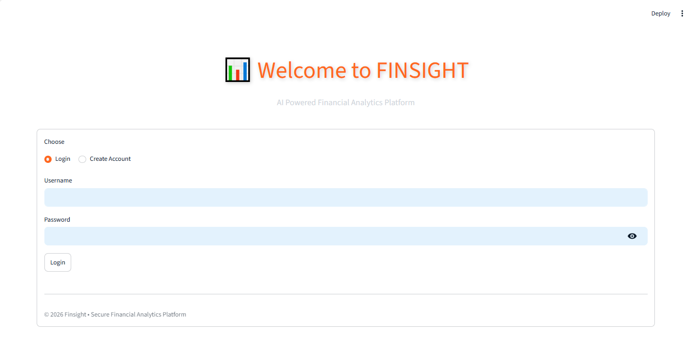
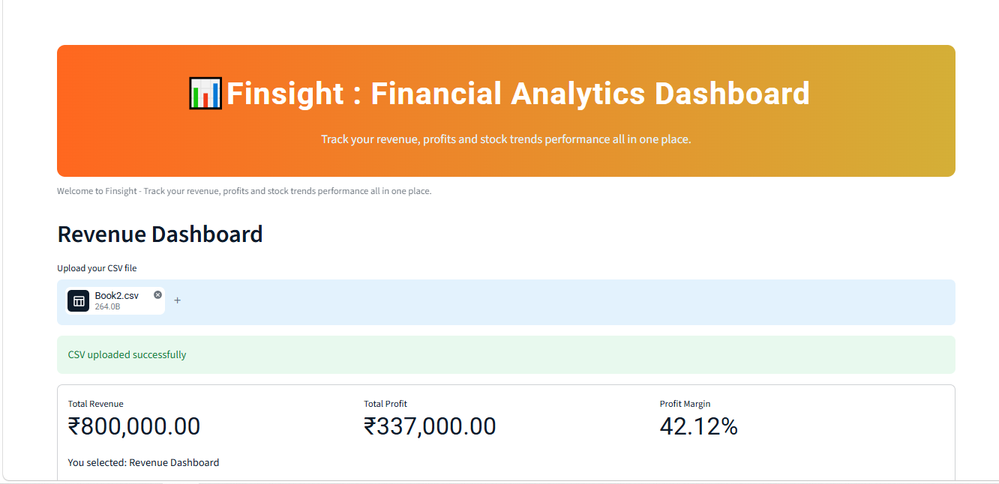
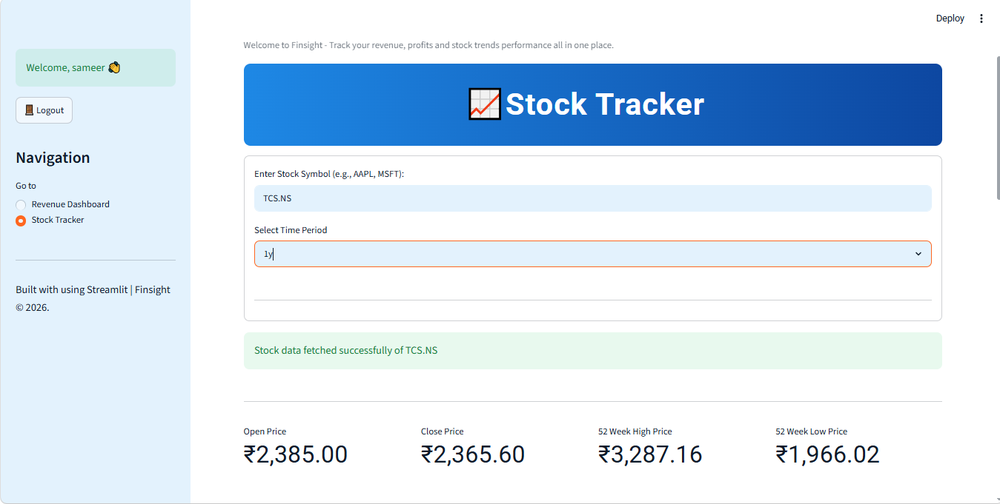
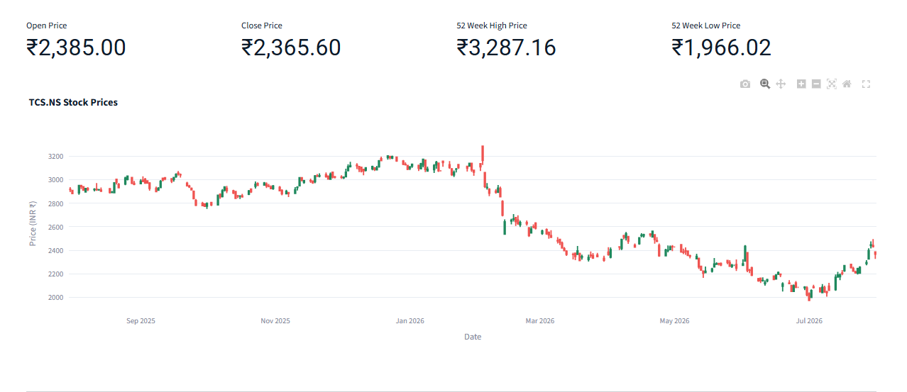

# 📊 FinSight - Financial Analytics Dashboard

FinSight is a full-stack finance analytics web app built entirely in Python. Upload your revenue CSV to instantly see KPI cards, trend charts, SQL-powered insights, and ML-based revenue forecasts. It also includes a live Stock Tracker with real-time price data and a 7-day prediction trend.

🔗 **Live App:** [finsight-finance.streamlit.app](https://finsight-finance.streamlit.app/)

## Features

- 📈 Upload any revenue CSV and get instant KPI cards (Total Revenue, Profit, Margin)
- 📊 Revenue vs Expenses trend chart and monthly profit chart
- 🔮 ML-powered revenue forecast (Linear Regression) for next month
- 📋 SQL-powered insights panel (top months, average profit, total expenses)
- 📥 Export cleaned data as CSV
- 💹 Live Stock Tracker — search any ticker, view candlestick charts
- 🔮 7-day stock price forecast using Linear Regression
- 🎨 Custom-themed, responsive Streamlit UI

## Tech Stack

| Category | Tools |
|---|---|
| Frontend | Streamlit |
| Backend | Python, Pandas, SQLite |
| Visualization | Matplotlib, Seaborn, Plotly |
| Machine Learning | Scikit-learn (Linear Regression) |
| Data Source | User CSV upload + Yahoo Finance API (yfinance) |
| Deployment | Streamlit Cloud |

## Project Structure
finsight/
|--app.py       #Main Streamlit Frontend
|--data_processor.py    #Data cleaning and KPI Calculations
|--data_manager.py      #SQlite database manager
|--stock_fetcher.py     #live stock data via yfinance
|--ml_predictor.py      #Revenue and stock forecasting
|--charts.py            #Chart generation functions
|--requirements.txt      #python dependencies
|--.streamlit/config.toml   #Customer theme
|-- Book2.CSV               #Sample dataset

##Screenshots
## 📸 Screenshots

### 🔐 Login Page

---

### 📊 Revenue Dashboard

---

### 📈 Stock Tracker

## 🤖 Machine Learning

Finsight uses Scikit-learn's Linear Regression model for:

- Revenue Forecasting
- 7-Day Stock Trend Prediction

## 🗄 Database

SQLite stores:

|-- Registered Users
|-- Revenue Dataset
|-- SQL Insights

Sample SQL Queries

|-- Top Revenue Months
|-- Average Profit
|-- Total Expenses

## 🚀 Future Improvements

- AI Financial Insights
- Advanced Stock Prediction Models
- PDF Report Generation
- Dark Mode
- User Profile Management
- Cloud Deployment

## 👨‍💻 Author

**Sameer Mehra**

Python Developer | Data Analytics Enthusiast

GitHub:
https://github.com/Sameer-Mehra2007